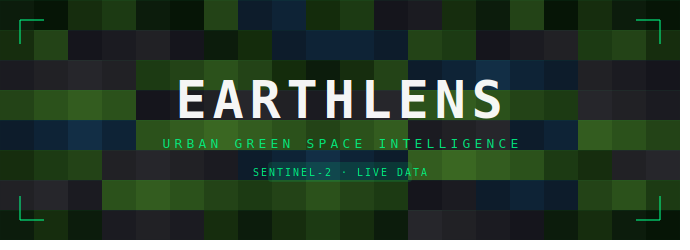

<div align="center">

# EarthLens

### Urban Green Space Intelligence Platform

*Real satellite imagery. Real environmental science. Real insights.*

<br/>

[](https://urban-green-mapper.vercel.app)
[](https://earthlens-backend.onrender.com/api/health)
[](https://planetarycomputer.microsoft.com)
[](https://fastapi.tiangolo.com)

<br/>

> EarthLens turns Sentinel-2 satellite bands into structured environmental intelligence - 
> vegetation maps, water signals, urban heat, and audience-aware insights, all from real orbital data.

</div>

<div align="center">
  
</div>
---

## What It Does

EarthLens fetches a real Sentinel-2 scene for a selected Canadian city, reads its spectral bands via Cloud-Optimised GeoTIFFs hosted on Microsoft Planetary Computer, and computes a full suite of environmental indices. The result is a rich, layered view of how a city breathes — its green canopy, water presence, built-up intensity, and urban heat signature — rendered at 1200×1200 px and delivered alongside audience-calibrated insights.

No mock data. No pre-rendered tiles. Every scan is live satellite processing.

---

## Satellite Layers

| Layer | Index | What It Reveals |
|---|---|---|
| **RGB** | True colour | Natural surface appearance |
| **NDVI** | `(NIR − Red) / (NIR + Red)` | Vegetation health and density |
| **NDWI** | `(Green − NIR) / (Green + NIR)` | Open water and moisture |
| **NDBI** | `(SWIR − NIR) / (SWIR + NIR)` | Built-up and impervious surface |
| **SAVI** | Soil-adjusted NDVI | Vegetation in low-cover terrain |
| **Classification** | NDVI thresholds | Land-cover categories |
| **Heat** | `NDBI − NDVI` | Urban heat island proxy |

---

## Environmental Metrics

Each scan returns a structured metrics object:

```
Green Coverage     →  % of pixels with NDVI > 0.20
Dense Canopy       →  % of pixels with NDVI > 0.60
Water Signal       →  % of pixels with NDWI > 0.05
Built-up Intensity →  % of pixels with NDBI > 0.10
Heat Risk Score    →  composite urban heat index (0–100)
Reliability Score  →  100 − cloud cover percentage
Mean NDVI / NDWI / NDBI
Temperature, Humidity, Wind (via Open-Meteo)
```

---

## Processing Pipeline

```
Microsoft Planetary Computer  (STAC search, signed COG URLs)
        │
        ▼
  rasterio + GDAL  (windowed read, overview-level, bilinear resample)
        │
        ▼
  NumPy  (index computation: NDVI, NDWI, NDBI, SAVI, heat)
        │
        ▼
  matplotlib  (1200×1200 px HD render, zero padding, bilinear interp)
        │
        ▼
  FastAPI  (base64 PNG + metrics + metadata → JSON response)
        │
        ▼
  React + Framer Motion  (layer switcher, metric cards, insight panels)
```

---

## Tech Stack

**Backend**
- `FastAPI` — async REST API
- `Gunicorn + Uvicorn` — production ASGI server
- `rasterio` — Cloud-Optimised GeoTIFF band reading
- `planetary-computer` — Planetary Computer asset signing
- `pystac` — STAC item parsing
- `NumPy` — spectral index computation
- `Matplotlib + Pillow` — HD image rendering

**Frontend**
- `React + Vite` — component-based UI
- `Framer Motion` — animated layer transitions

**Data**
- `Sentinel-2 L2A` via Microsoft Planetary Computer STAC API
- `Open-Meteo` — real-time weather context

**Deployment**
- Frontend → Vercel
- Backend → Render Free Web Service

---

## Project Structure

```
urban-green-mapper/
├── backend/
│   ├── app/
│   │   ├── api/
│   │   │   └── routes/
│   │   │       ├── scan.py          # POST /api/scan
│   │   │       ├── chat.py          # POST /api/chat
│   │   │       └── health.py        # GET  /api/health
│   │   ├── services/
│   │   │   ├── real_scan_service.py # satellite pipeline core
│   │   │   └── insight_service.py  # audience-aware text generation
│   │   ├── schemas/
│   │   │   └── scan.py             # ScanRequest / ScanResponse
│   │   └── main.py
│   └── requirements.txt
│
├── frontend/
│   ├── src/
│   │   ├── components/             # EarthViewer, MetricCard, ChatPanel …
│   │   ├── api.js                  # fetch wrappers
│   │   └── App.jsx
│   └── package.json
│
└── README.md
```

---

## Local Setup

**Backend**
```bash
cd backend
pip install -r requirements.txt
uvicorn app.main:app --reload --port 8000
```

**Frontend**
```bash
cd frontend
npm install
npm run dev
```

Create `frontend/.env.local`:
```
VITE_API_BASE_URL=http://localhost:8000
```

---

## Supported Cities

All 14 Canadian capital cities are supported with pre-mapped bounding boxes:

Ottawa · Toronto · Vancouver (Victoria) · Edmonton · Winnipeg · Regina  
Quebec City · Halifax · Fredericton · Charlottetown · St. John's  
Whitehorse · Yellowknife · Iqaluit

---

## Design Notes

- **Images are rendered server-side** at 1200×1200 px (dpi=150, figsize=8×8) with bilinear interpolation - consistent quality regardless of client device
- **Scans are cached** per city using `lru_cache` - repeat requests are instant
- **No mock fallback** - all imagery is live Sentinel-2 data
- **First scan may take 15–30 s** on Render Free tier due to cold start + satellite retrieval; subsequent scans for the same city are cached and near-instant
- **SWIR band (B11)** is natively 20 m resolution and is bilinearly upsampled to match all 10 m bands

---

<div align="center">
<sub>Built with Sentinel-2 · Microsoft Planetary Computer · FastAPI · React</sub>
</div>

## Author

Shubhangi Singh || AI Engineer
